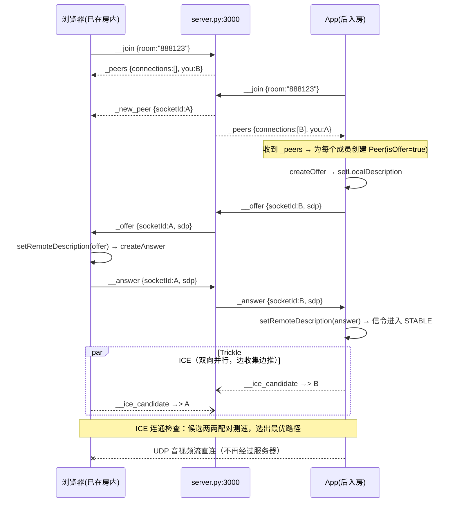

# WebRTC 视频通话（Android App ⇄ 浏览器）+ 弱网自适应

一个可局域网实测的双人视频通话项目：Android App 与浏览器网页端通过一台**本地 WebRTC 信令服务器**（`server.py`）互相发现并交换信令，随后建立点对点（P2P）音视频连接；App 端内置基于实时统计的**弱网检测与自适应降级/恢复**策略，以及 ICE 断线重连状态机。

```
        ┌─────────────────────────── 局域网 ───────────────────────────┐
        │                                                              │
  Android App ──ws:3000──┐                        ┌──ws:3000── 浏览器端
  (webrtclib)            │   本地信令服务器        │   (browser-peer.html)
        │                └─────  server.py  ──────┘         │
        │                                                   │
        └───────────  UDP 音视频流（WebRTC 直连，P2P）  ─────┘
                    （信令走 TCP/WS，媒体走 UDP，两通道互不占用）
```

三个核心组件：

| 组件 | 位置 | 职责 |
|------|------|------|
| 信令服务器 | `server.py`（Python asyncio + websockets，端口 3000） | 房间管理、信令推送转发，**不碰任何媒体数据** |
| 浏览器端 | `test-client/browser-peer.html`（配合 `python3 -m http.server 8080` 访问） | 第二端通话方，真实摄像头/麦克风 |
| Android App | `app/` + `webrtclib/` | 通话主端：连接流程、渲染、弱网自适应、ICE 重连 |

---

## 一、WebRTC 本地服务器：为什么需要它

WebRTC 是 P2P 的，音视频流**不经过服务器**，但两个陌生端在通话建立前必须先回答三个问题：

1. **我在跟谁通话？** —— 需要「房间」概念把用户组织起来，成员互相感知（谁进来了、谁走了）。
2. **我要收什么样的流，你能发什么样的流？** —— 需要交换 SDP（Session Description Protocol）：编解码器、分辨率、带宽、媒体端口等能力清单，即 Offer/Answer 协商。
3. **我们的网络路径怎么走才通？** —— 需要交换 ICE Candidate（本机局域网地址、经 STUN 探测出的公网地址、TURN 中继地址），双方各自尝试连通并选出最优路径。

这三类消息都是文本 JSON，必须有一个双方都能连上的「中间人」代为转达——这就是**信令服务器**。它刻意做得很薄：`server.py` 全文只有 135 行，因为它只需要「收消息 → 查目标 → 原样转发」，完全不需要理解 SDP/ICE 的内容。

> 类比：信令服务器是电话总机，帮你把「我要找 8 号房的人」这句话递过去；接通之后你们说什么、说多快，总机一概不管。

## 二、信令推送原理（server.py 核心机制）

### 2.1 两张内存表

```python
sockets = {}   # client_id -> websocket 连接      （所有在线连接）
rooms   = {}   # 房间名    -> [client_id, ...]    （房间成员列表）
```

服务器是纯单进程内存态，没有数据库、没有用户系统。每个 WebSocket 连接建立时分配一个 UUID 作为 `client_id`（即整个协议里贯穿始终的 `socketId`）：

```python
client_id = str(uuid.uuid4())
sockets[client_id] = websocket
```

### 2.2 事件协议：`__` 是上行，`_` 是下行

所有消息统一为 `{ "eventName": ..., "data": {...} }`。事件名的前缀约定一眼可辨方向：

- **双下划线 `__xxx`：客户端 → 服务器**（请求/上报）
- **单下划线 `_xxx`：服务器 → 客户端**（推送/应答）

| 方向 | 事件 | data 关键字段 | 含义 |
|------|------|---------------|------|
| ↑ | `__join` | `room` | 请求加入房间 |
| ↓ | `_peers` | `connections[]`, `you` | 推给新入房者：房间现有成员 + 自己的 id |
| ↓ | `_new_peer` | `socketId` | 推给老成员：某人刚入房 |
| ↑ | `__offer` / `__answer` | `socketId`, `sdp{type,sdp}` | 请求把 SDP 转给指定对端 |
| ↓ | `_offer` / `_answer` | `socketId`(发件人), `sdp` | 服务器代为推送的 SDP |
| ↑ | `__ice_candidate` | `socketId`, `id`, `label`, `candidate` | 请求把一条 ICE 候选转给指定对端 |
| ↓ | `_ice_candidate` | 同上 + `socketId`(发件人) | 代为推送的 ICE 候选 |
| ↓ | `_remove_peer` | `socketId` | 推给房内成员：某人已断开 |

### 2.3 三种推送模型

服务器的全部转发逻辑可归纳为三种模型：

**① 入房时的「一对多 + 一对一回告」**（`__join` 处理，见 `server.py:27-55`）：

```
新成员 B 发 __join(room)
  ├─ 遍历 rooms[room]，给每个老成员 A 推送 _new_peer{socketId: B}   （群发通知）
  ├─ rooms[room].append(B)
  └─ 只给 B 回推 _peers{connections: [A...], you: B}                （点名回告）
```

这样 B 拿到「房间里还有谁」，A 们拿到「房里多了谁」，双方视角即刻对齐，不需要轮询。

**② 定向转发（unicast by socketId）**（`__offer` / `__answer` / `__ice_candidate`，见 `server.py:57-94`）：

```python
target_id = event_data.get('socketId')          # 发件人指明给谁
if target_id in sockets:                        # 目标还在线？
    await sockets[target_id].send(json.dumps({
        "eventName": "_offer",                  # 上行事件名换成下行事件名
        "data": { **payload, "socketId": client_id }   # 盖上发件人戳
    }))
```

三个要点：服务器**只改事件名前缀、不改载荷**（SDP 字符串原样搬运）；转发时把 `socketId` 替换为**发件人**的 id，接收方才知道「这份 Offer 该回给谁」；目标不在线则静默丢弃（对端可能已挂断，属正常竞态）。

**③ 离房广播（含容错清理）**（连接关闭的 `finally` 块，见 `server.py:101-125`）：

```
连接断开（无论正常关闭还是异常掉线）
  ├─ 先从 rooms 所有房间移除自己          （先改状态，再发通知）
  ├─ 逐个给房内剩余成员推送 _remove_peer  （每个 send 单独 try/except）
  ├─ 房间空了则删除房间
  └─ sockets.pop(client_id)
```

这里有一条用真实故障换来的经验：**「先移除、后通知」且「逐个容错」**。早期版本是边通知边移除，只要给某个半死连接 send 抛出 `ConnectionClosed`，整个清理就中断，离房者以僵尸身份残留在 `rooms` 里——重进房间的新客户端拿到错误的成员列表，通话建立不起来（`server.py:102-104` 的注释即记录此事）。

### 2.4 推送的底层：asyncio 单线程事件循环

`websockets.serve` 为每个连接跑一个 `handle_connection` 协程，`async for message in websocket` 持续读取；所有 `await send(...)` 都是非阻塞写。单进程 asyncio 模型对信令场景绰绰有余——消息是小体积 JSON、频率低（每通话几条到几十条）、无 CPU 密集操作。这也解释了为什么整个服务器 135 行就够：**信令的本质是路由，不是计算**。

## 三、一次通话的完整建立流程（端到端）

以「浏览器 B 先在房间 888123，App A 后进入」为例（joiner 主动 Offer 模型）：



App 端各环节的代码落点（`webrtclib/` 模块）：

| 环节 | 类 | 说明 |
|------|----|------|
| WS 收发 + 协议解析 | `signaling/WebSocketManager` | 只做 JSON 编解码，业务交给回调 |
| 信令事件 → 连接编排 | `peer/PeerConnectionManager` | 实现 `SignalCallback`：`_peers` 建 Peer 发 Offer、`_offer/_answer` 设置远端描述、`_ice_candidate` 投递候选；所有 PeerConnection 操作走单线程 executor |
| 单条 P2P 连接 | `peer/Peer` | 持有 PeerConnection，SDP 状态机驱动；ICE 候选在远端描述未就绪时用 `iceLock` 保护的队列暂存，`onSetSuccess` 后排空 |
| 门面 | `WebRTCManager` | UI 只对它说话：init/connect/hangup/release、摄像头/音频控制、弱网策略下发 |

两个实现细节值得注意：

- **Unified Plan 约束**：新版 WebRTC（本项目 1.3.10 自编译 .so 与 Maven io.github.webrtc-sdk 125 均如此）默认 UnifiedPlan 语义，`pc.addStream()` 会触发 native CHECK 崩溃，必须逐轨道 `addTrack(track, streamIds)`，接收侧对应 `onAddTrack`。
- **锁与 JNI 的死锁陷阱**：`pc.signalingState()` 这类 getter 是同步 JNI，内部要等 WebRTC 信令线程响应。若在持有 Java 监视器时调用它，而信令线程回调又排队等这把监视器，就会死锁（曾表现为挂断重进后无画面 + ANR）。规则：**任何 `pc.*` native 调用都不在持锁状态下发起**，ICE 队列用独立的 `iceLock` 且入队/出队后才解锁调用。

## 四、弱网自适应（App 端策略层）

媒体流直连后，服务器帮不上忙，弱网全部由 App 端自己扛。机制是一条闭环：

```
pc.getStats() ──每2s──> NetworkQualityMonitor 打分
   (RTT / 丢包率 / GCC可用上行带宽，三项取最差)
        │  降级需连续2次更差；恢复需连续4次更好且一次只回一档（滞回防抖）
        ▼
  优 / 良 / 差 / 极差 四档
        │
        ▼  WebRTCManager.applyQualityPolicy（无需重协商，即时生效）
  ① RtpSender.setParameters → 限视频最大编码码率 1.5M/800k/300k/64k
  ② VideoSource.adaptOutputFormat → 采集端降分辨率帧率 640x480@15 → 480x360@8
  ③ 极差档：localVideoTrack.setEnabled(false) → 关视频保音频
```

另一条独立的状态机负责**断线**（而非慢）：ICE `DISCONNECTED` 给 4 秒宽限期（WebRTC 常能自愈），超时未恢复或 `FAILED` 立即 `restartIce` + 重新 Offer，10 秒复查，最多 2 次，超限按离会拆链。

弱网注入测试环境（macOS dummynet + pf，只损 Mac⇄平板的 UDP、不碰 TCP 信令）与四轮 A/B 实测结论见 `弱网功能实现总结.md`；操作手册见 `user.md`。

## 五、快速开始

```bash
# 1. 启动信令服务器（需要 python3 + websockets：pip3 install websockets）
python3 server.py                    # 监听 0.0.0.0:3000

# 2. 启动浏览器端（静态服务 + Chrome 免弹窗授权真实摄像头）
python3 -m http.server 8080
# 访问 http://localhost:8080/test-client/browser-peer.html，输入房间号加入

# 3. 安装并启动 App（连接同一局域网的 ws://<Mac的IP>:3000，相同房间号）
./gradlew :app:assembleDebug
~/Library/Android/sdk/platform-tools/adb install -r app/build/outputs/apk/debug/app-debug.apk
```

注意事项：

- Mac 本机 IP 会 DHCP 漂移，两端要用**同一个** IP（`ipconfig getifaddr en0` 查看）。
- 浏览器在非 localhost 访问时 getUserMedia 需要 HTTPS 或 Chrome 参数 `--unsafely-treat-insecure-origin-as-secure=...`；本机测试用 `localhost` 最省事。
- 局域网测试 STUN 即可互通（App 默认配 `stun:stun.l.google.com:19302`，同网段走 host 候选就能连上）；跨 NAT 场景在 `WebRTCManager.buildIceServers()` 里追加 TURN。
- 历史文档 `README-LOCAL.md` 描述的是早期 Node.js SkyRTC + coturn 方案，该目录已不在本项目中，当前信令服务器以本 README 所述 `server.py` 为准。

## 六、目录结构

```
WebRtc/
├── server.py                      # 本地信令服务器（本文第二章逐行对应）
├── test-client/
│   ├── browser-peer.html          # 浏览器端通话页（第二端）
│   ├── cdp-drive.py               # Chrome DevTools 协议驱动（自动化测试用）
│   └── weaknet.sh                 # dummynet 弱网注入脚本（on/off/status）
├── webrtclib/                     # WebRTC 封装库（信令/Peer/渲染/弱网监测）
│   └── src/main/java/com/wangyao/webrtclib/
│       ├── WebRTCManager.java             # 门面 + 弱网策略下发
│       ├── signaling/WebSocketManager.java # 信令协议层
│       └── peer/                          # Peer / PeerConnectionManager / NetworkQualityMonitor
├── app/                           # Android 应用（MainActivity / CallActivity）
├── user.md                        # 用户使用手册（搭建全过程）
├── 弱网功能实现总结.md              # 弱网特性原理与实测报告
└── CSDN-WebRTC视频通话与弱网自适应技术博客.md   # 对外发表版长文
```
